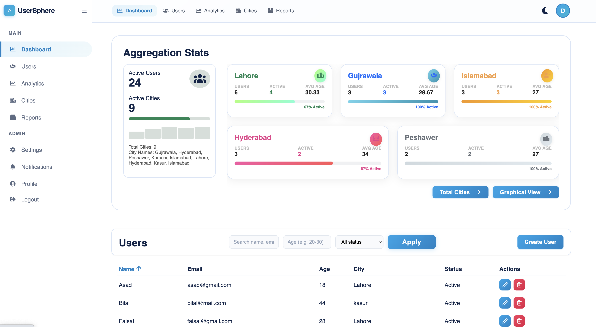
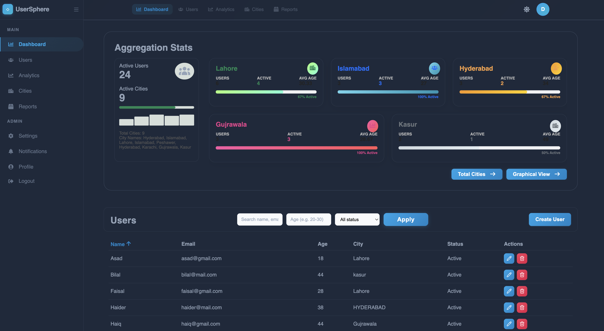
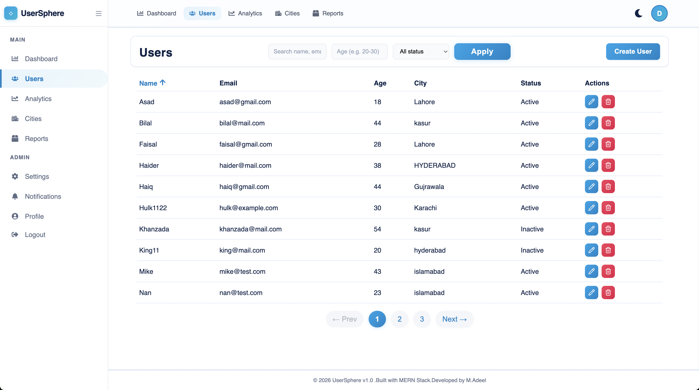
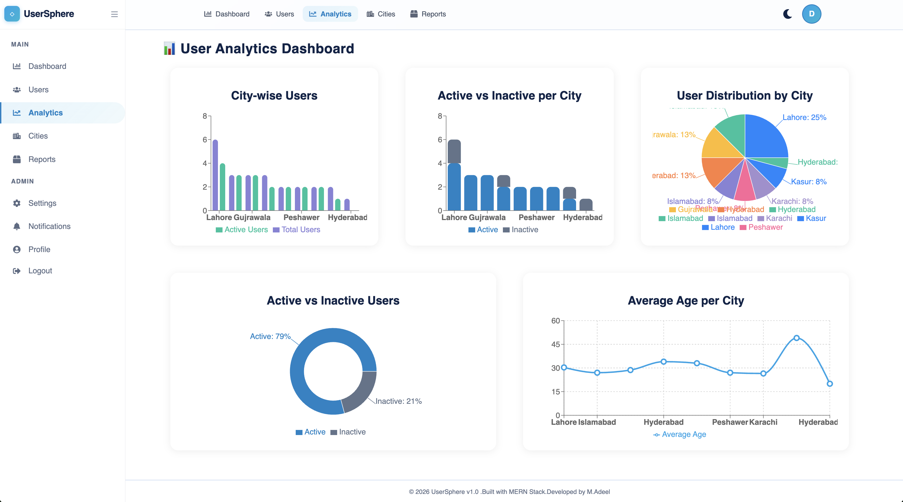
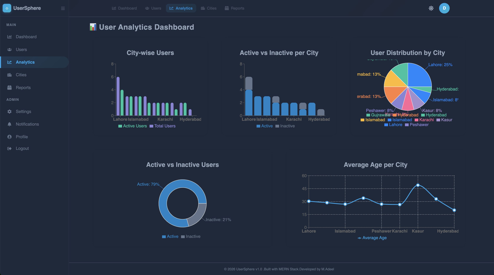
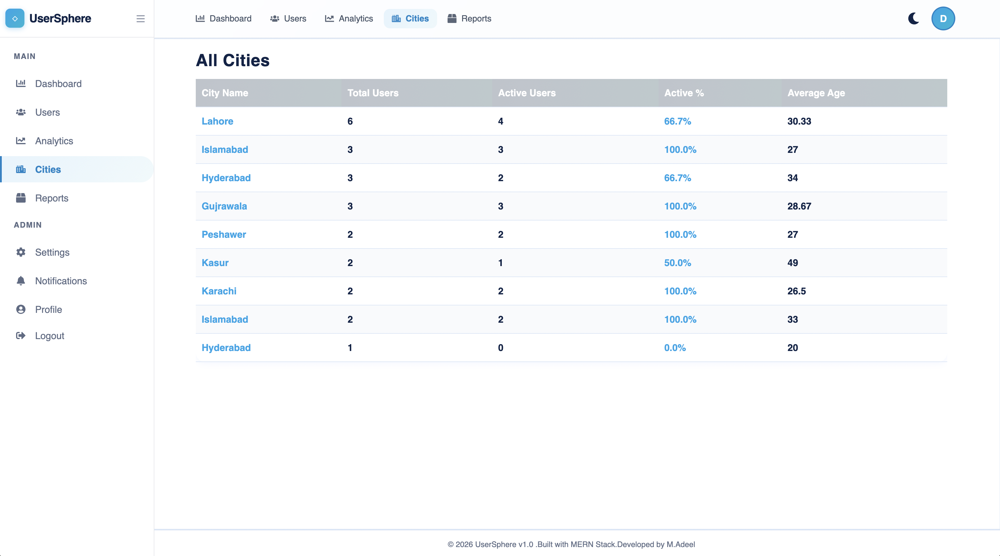
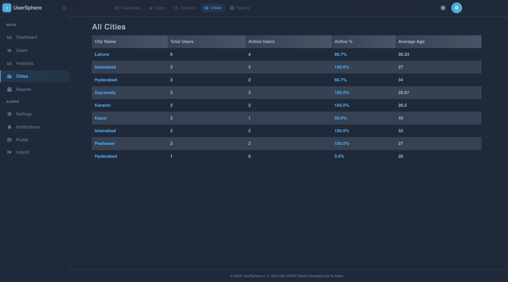
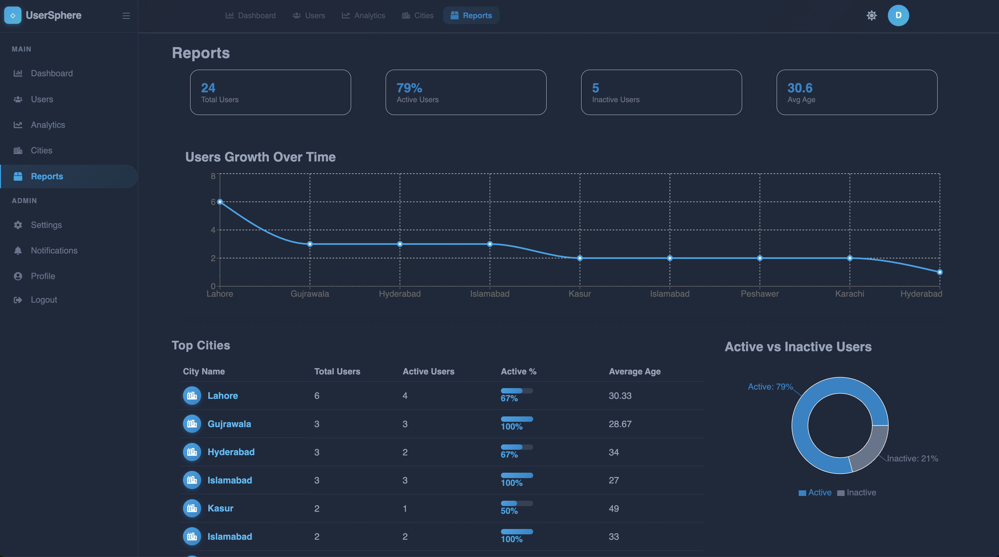
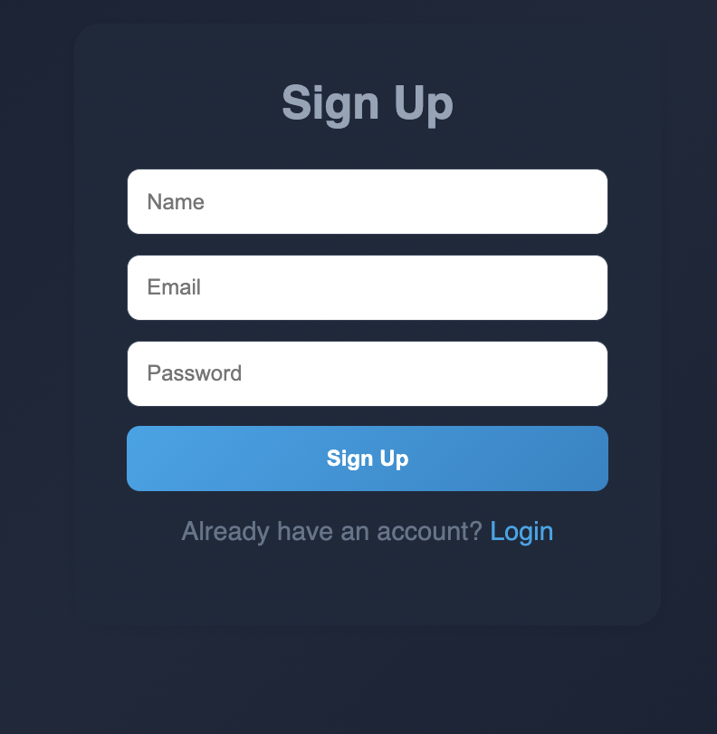

# UserSphere

A full-stack MERN application for user management with JWT authentication, role-based access control, and interactive dashboards.

---

## Tech Stack

| Layer | Technology |
|-------|------------|
| Frontend | React 19, Vite, React Router, Recharts |
| Backend | Node.js, Express.js |
| Database | MongoDB, Mongoose |
| Auth | JWT, bcryptjs |

---

## Features

- User CRUD operations (Create, Read, Update, Delete)
- JWT authentication with login/signup
- Role-based access (Admin can delete users)
- Interactive dashboard with statistics
- Graphical data visualization (charts)
- **AI-powered growth predictions** (30-day forecast)
- City-wise user analytics
- Search and filter functionality
- Pagination
- Dark/Light theme toggle
- Responsive design

---

## Project Structure

```
users-crud/
├── frontend/          # React application
│   ├── src/
│   │   ├── components/
│   │   ├── pages/
│   │   ├── layout/
│   │   ├── context/
│   │   └── services/
│   └── package.json
│
├── backend/           # Express API
│   ├── src/
│   │   ├── controllers/
│   │   ├── models/
│   │   ├── routes/
│   │   ├── middlewares/
│   │   └── app.js
│   └── package.json
│
└── README.md
```

---

## Quick Start

### Prerequisites

- Node.js 18+
- MongoDB (local or Atlas)

### 1. Clone & Install

```bash
# Install backend dependencies
cd backend
npm install

# Install frontend dependencies
cd ../frontend
npm install
```

### 2. Environment Setup

**Backend Variables** (`backend/.env`):

| Variable | Description | Example Value |
|:---------|:------------|:--------------|
| `PORT` | The port the server runs on | `3000` |
| `MONGODB_URI` | MongoDB connection string | `mongodb://127.0.0.1:27017/usersphere` |
| `JWT_SECRET` | Secret key for JWT tokens (secret) | `your-secret-key` |
| `FRONTEND_ORIGIN` | Frontend URL for CORS | `http://localhost:5173` |

**Frontend Variables** (`frontend/.env`):

| Variable | Description | Example Value |
|:---------|:------------|:--------------|
| `VITE_API_BASE_URL` | Backend API base URL | `http://localhost:3000/api` |

### 3. Run

```bash
# Terminal 1 - Backend
cd backend
npm run dev

# Terminal 2 - Frontend
cd frontend
npm run dev
```

- Frontend: http://localhost:5173
- Backend: http://localhost:3000

---

## API Overview

| Method | Endpoint | Description | Auth |
|--------|----------|-------------|------|
| POST | `/api/auth/register` | Register admin | No |
| POST | `/api/auth/login` | Login | No |
| GET | `/api/auth/me` | Get current user | Yes |
| GET | `/api/users` | Get all users | Yes |
| POST | `/api/users` | Create user | Yes |
| PATCH | `/api/users/:id` | Update user | Yes |
| DELETE | `/api/users/:id` | Delete user | Admin |
| GET | `/api/users/stats` | City statistics | No |
| GET | `/api/users/general-stats` | General stats | No |
| GET | `/api/users/predictions` | AI growth predictions | No |

See [`backend/API.md`](./backend/API.md) for full API documentation.

---

## Screenshots

### Dashboard
| Light Mode | Dark Mode |
|------------|-----------|
|  |  |

### Users Table


### Analytics
| Light Mode | Dark Mode |
|------------|-----------|
|  |  |

### Cities
| Light Mode | Dark Mode |
|------------|-----------|
|  |  |

### Reports (Dark Mode)


### Sign Up


---

## Scripts

### Backend

```bash
npm start      # Production
npm run dev    # Development with watch
```

### Frontend

```bash
npm run dev    # Development server
npm run build  # Production build
npm run preview # Preview build
```

---

## License

MIT

---

Built with MERN Stack
